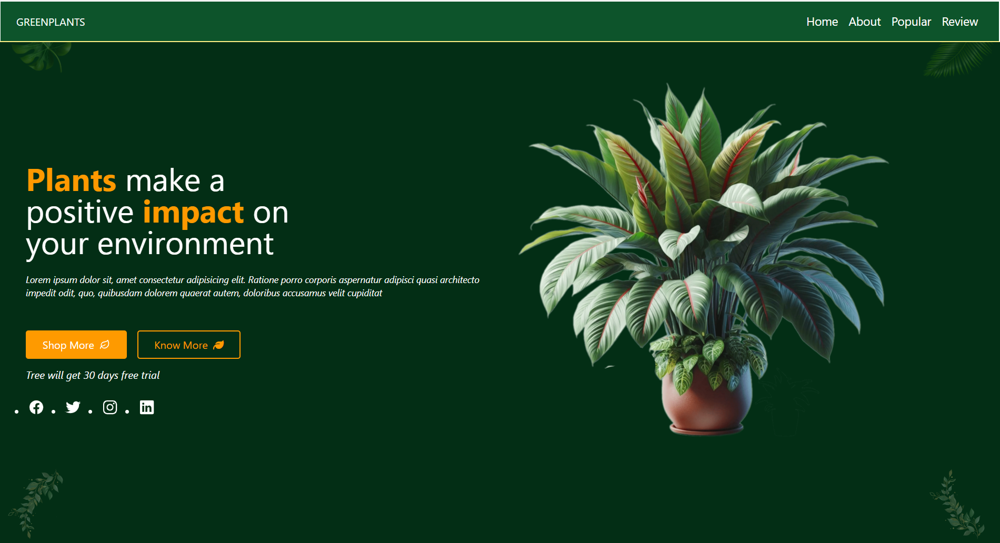
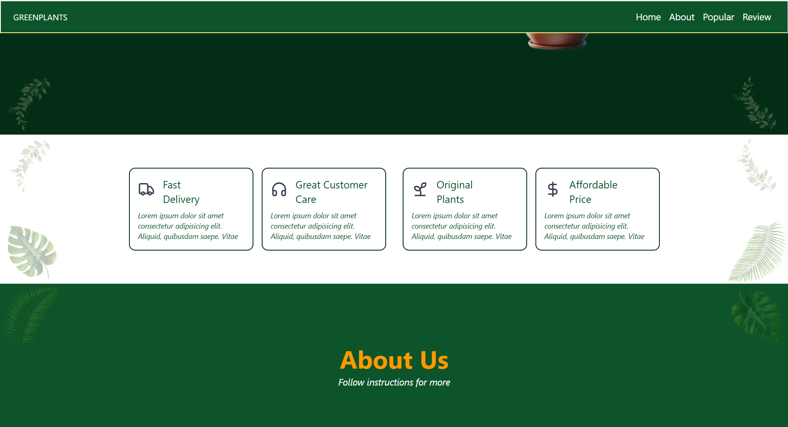
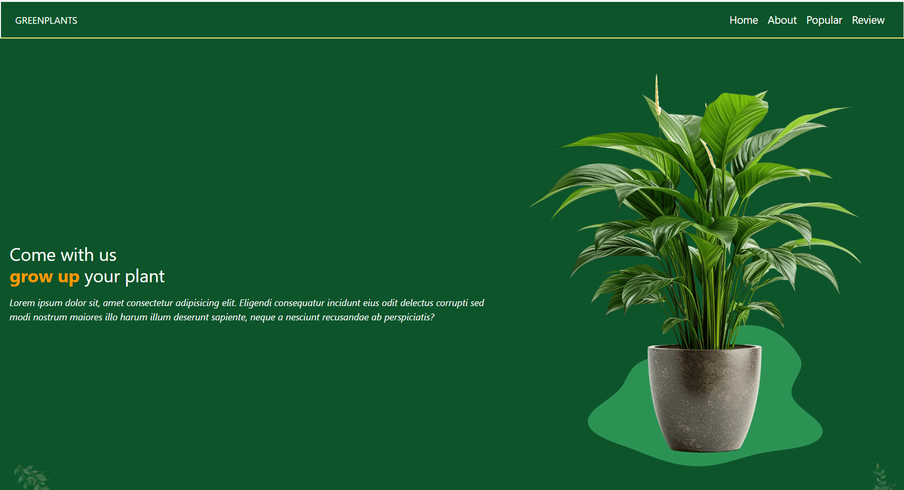
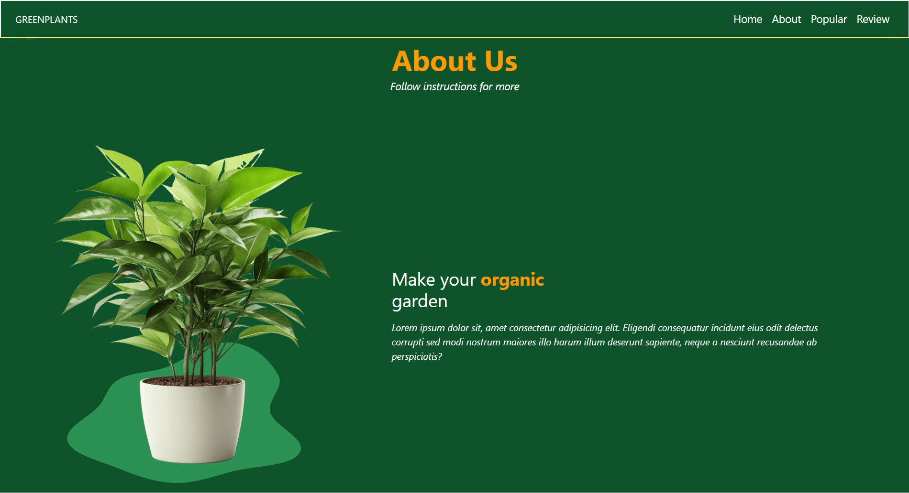
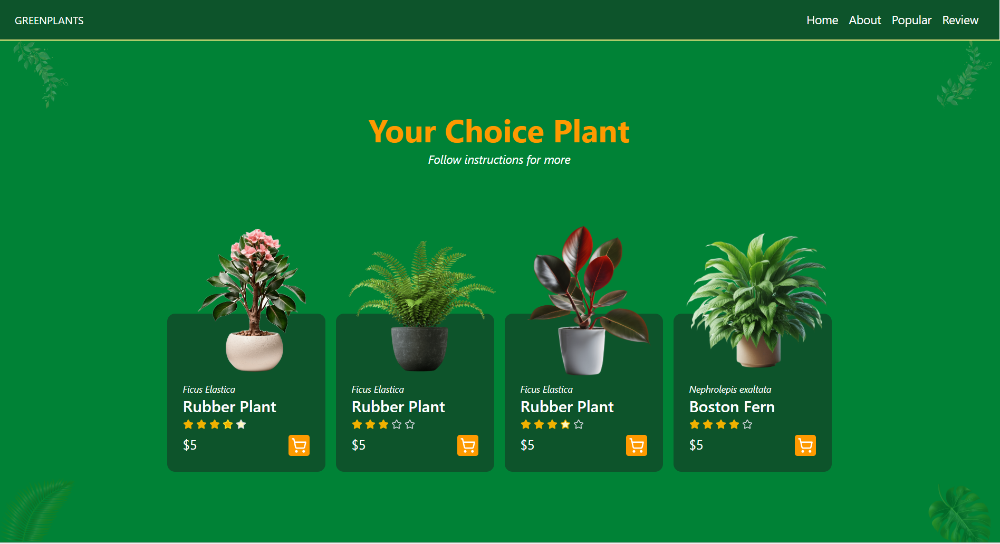
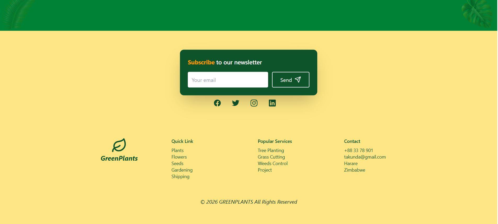

# 🌿 GreenPlants Website

A modern and responsive **Plant Store Landing Page** built using **HTML, Tailwind CSS, and JavaScript**.
This project presents a clean UI for showcasing plants, services, and company information with attractive sections and animations.

The website includes sections such as **Home, About, Popular Plants, Services, and Contact**, designed to create a visually appealing plant shop landing page.

---
## 🚀 Features
* 🌿 Modern plant-themed UI design
* 📱 Fully responsive layout
* 🧭 Fixed navigation bar with smooth scrolling
* ⭐ Product cards for popular plants
* 🎨 Custom Tailwind CSS styling
* 🖼 Decorative leaf background elements
* 📩 Newsletter subscription section
* 🔗 Social media icons integration
* ✨ Hover animations and card effects
---

## 🛠️ Technologies Used

* HTML5
* Tailwind CSS
* JavaScript
* Font Awesome Icons
* Ionicons
* Lucide Icons
* Animate.css
* AOS Animation Library

---

## 📂 Project Structure

```
GreenPlants/
│
├── index.html
├── script.js
├── input.css
├── output.css
├── tailwind.config.js
│
├── assets/
│   ├── img/
│   │   ├── home.png
│   │   ├── plant-1.png
│   │   ├── plant-2.png
│   │   ├── cart-1.png
│   │   ├── cart-2.png
│   │   ├── cart-3.png
│   │   ├── cart-4.png
│   │   └── leaf images
│
└── README.md
```

---

## ⚙️ Website Sections

### 🏠 Home Section

* Introductory hero section
* Call-to-action buttons
* Social media icons
* Plant illustration

### 🌱 Services Section

Displays important services such as:

* Fast Delivery
* Customer Care
* Original Plants
* Affordable Prices

### 🌿 About Section

Explains the purpose of the plant website and benefits of gardening.

### 🪴 Popular Plants Section

Shows featured plants with:

* Ratings
* Price
* Add-to-cart icon

### 📩 Newsletter Section

Allows users to subscribe with their email.

### 🔗 Footer

Contains:

* Social media links
* Quick links
* Services
* Contact information

---

## ▶️ How to Run the Project

1. Download or clone the repository

```
git clone https://github.com/takundagorogodo/GreenPlants-Website.git
```

2. Open the project folder.

3. Open **index.html** in your browser.

No installation required.

---
## 🖼️ Screenshots

<p align="center">
  
  
  
</p>

<p align="center">
  
  
</p>  

<p align="center">
  
  
</p>
---

## 🎯 What I Learned
* Building responsive websites with Tailwind CSS
* Designing modern landing pages
* Creating reusable UI components
* Using icon libraries and animations
* Structuring frontend projects
* Applying hover and transition effects

---

## 📌 Future Improvements
* Deploy the website online

---
## 👨‍💻 Author

Takundah Gorogodo

Computer Science Student | Web Development Enthusiast

---

## 📄 License

This project is open-source and created for learning and educational purposes.
